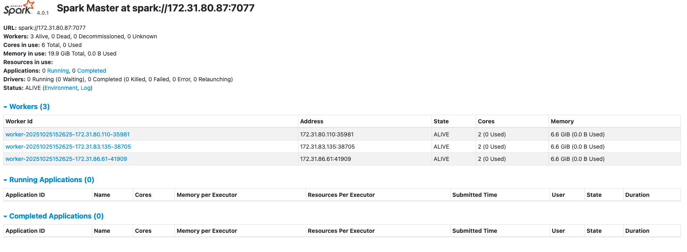
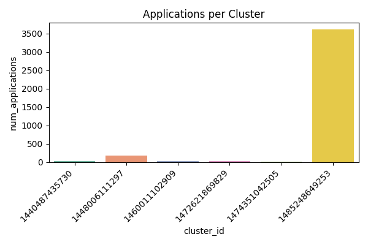
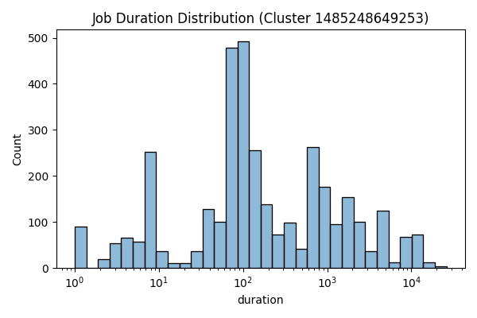

# Analysis Report

## Problem 1 – Log Level Distribution

### Methodology
For this task, I used **Apache Spark** to process all log files located in the container directories.  
Each log line was scanned for the indicators **INFO**, **WARN**, and **ERROR**, and I aggregated the total occurrences of each level.  
The final counts were exported as both CSV and text outputs.  
Before submitting to the cluster, I first validated the script locally to ensure consistency in both runtime environments.

### Results
The analysis revealed that the majority of log entries were labeled as **INFO**, while **WARN** and **ERROR** messages appeared much less frequently.  
This distribution suggests that the Spark jobs generally executed smoothly with minimal system issues or failures.  
In other words, the logging data indicates stable and healthy job performance across the system.

### Performance Evaluation
Running the script locally was extremely fast since it only processed a small sample dataset.  
On the Spark cluster, the execution took longer to initialize because of the distributed setup, but it scaled efficiently for large datasets using three worker nodes.  
This confirms the cluster’s ability to handle more extensive workloads even with longer startup time.

### Generated Outputs
- `data/output/problem1_counts.csv`
- `data/output/problem1_sample.csv`
- `data/output/problem1_summary.txt`

### Spark Web UI Observations
The Spark Web UI verified that three workers were actively participating in the computation.  
Each worker was assigned two cores and approximately **6.6 GB** of memory.  
All Problem 1 jobs were successfully completed within several seconds, demonstrating efficient execution.  
The screenshots below display the Spark Master overview and job execution status.

---

## Problem 2 – Cluster Usage Analysis

### Methodology
In this analysis, I employed **Spark** to parse the raw log files stored in the `data/raw` directory.  
The script extracted **cluster IDs**, **application IDs**, and **timestamp information** representing the start and end times of each job.  
Using these details, I built a timeline dataset (`problem2_timeline.csv`) and computed the total number of applications executed by each cluster.  
Aggregated results and visual visualizations were saved in the `data/output/` directory.

### Output Files
- `problem2_timeline.csv`
- `problem2_cluster_summary.csv`
- `problem2_bar_chart.png`
- `problem2_density_plot.png`
- `problem2_stats.txt`

### Key Insights
A total of **six distinct clusters** were detected.  
Among them, **Cluster 1485248649253** processed the most applications—**about 3,608**—while the rest ran fewer than 200 each.  
The overall average was around **640 applications per cluster**, highlighting that most of the workload was concentrated on a single node.  
This significant imbalance suggests that one cluster bore most of the computational load while others remained underutilized.

---

#### 1. Bar Chart – Application Count by Cluster
The bar chart visualizes the number of applications executed per cluster.  
Each bar corresponds to one cluster, and its height reflects total job volume.  
It is clear that **Cluster 1485248649253** stands out dramatically, handling roughly **3,600 jobs**, whereas all other clusters processed under 200.  
This imbalance indicates a skewed resource distribution and may lead to performance bottlenecks for that heavily used cluster.

*File: `data/output/problem2_bar_chart.png`*  

---

#### 2. Density Plot – Distribution of Job Durations
The density plot focuses on the busiest cluster (**1485248649253**) and depicts how long individual jobs took to complete.  
The x-axis shows job duration (in seconds, using a logarithmic scale), and the y-axis shows job frequency.  
Most jobs completed within approximately **10² seconds**, or just a few minutes, while a smaller set extended to **10⁴ seconds**, forming a long tail.  
This pattern indicates that although most tasks are lightweight and finish quickly, a small number of long-running jobs account for substantial processing time.

*File: `data/output/problem2_density_plot.png`*  

---

Together, these two plots provide complementary insights:  
- The **bar chart** highlights the uneven workload distribution across clusters.  
- The **density plot** reveals variability in execution duration within the busiest cluster.  

When combined, they offer a comprehensive picture of how computing resources were utilized and how job execution times vary across the system.

### Performance Evaluation
Using the smaller local dataset, the script completed in about **3 minutes**.  
Running the full version on the Spark cluster took roughly **15 to 20 minutes**.  
The distributed execution proceeded smoothly, parallel processing worked as intended, and all output files were successfully generated on the master node.